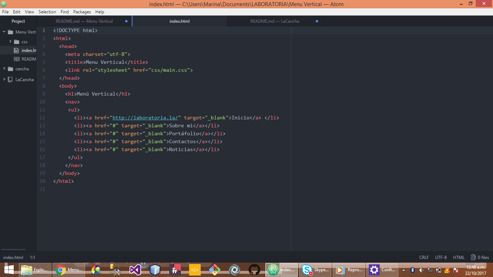
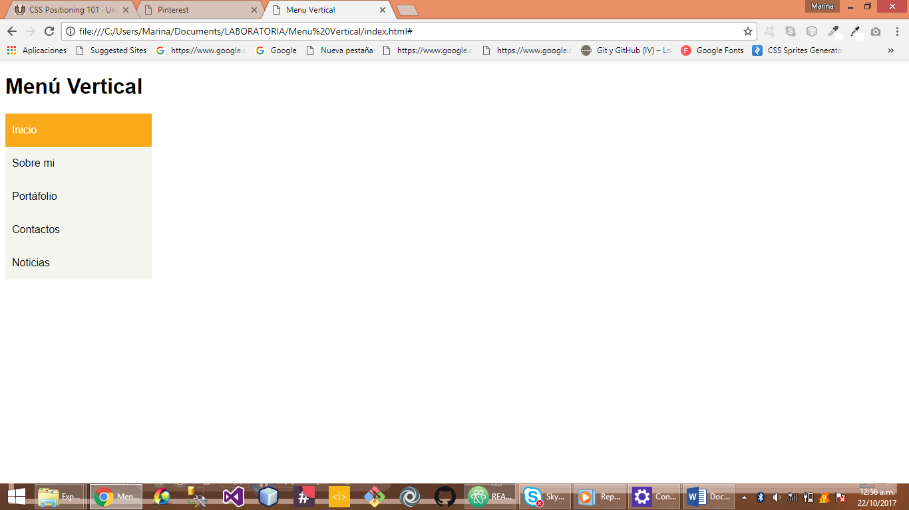

# MENÚ VERTICAL

En este trabajo podras encontrar información para realizar un menú desplegable pero de forma vertical.

**EN NUESTRO ARCHIVO HTML TENDREMOS**

LA ESTRUCTURA DE NUESTRO MENÚ CON NUESTRAS LISTAS.

**EN NUESTRO ARCHIVO CSS TENDREMOS**

TODAS LOS ESTILOS ASIGNADOS A CADA LISTA UTILIZANDO LOS SELECTORES COMO:

 **HOVER** PARA CREAR UN EFECTO SOBRE EL LINK.
 **ACTIVE** PARA CAMBIAR LOS EFECTOS AL HACER CLICK SOBRE CADA LINK.

NUESTRO PRODUCTO FINAL SERA EL SIGUIENTE :

